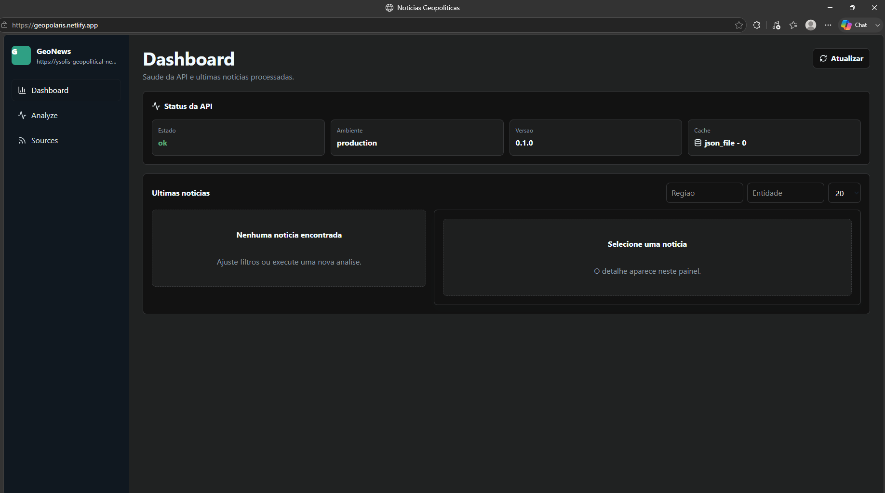

# Deploy

Este guia cobre backend FastAPI em Docker/Hugging Face Spaces e frontend Vite no Netlify.

## Estado publicado

- Space: `https://huggingface.co/spaces/ySolis/geopolitical-news-api`
- API pública: `https://ysolis-geopolitical-news-api.hf.space`
- Frontend: `https://geopolaris.netlify.app`
- Commit publicado no Space: `6d28f8a`
- Em 2026-06-10, frontend, `/health` e `/docs` foram validados.
- Build e execução local do Docker foram validados.
- Backend: pytest 8/8.
- Frontend: testes 8/8, build concluído e audit com 0 vulnerabilidades.



## Backend em Docker

O Dockerfile fica em `backend/Dockerfile`. Ele instala `requirements.txt`, copia `app/` e inicia:

```sh
uvicorn app.main:app --host 0.0.0.0 --port 8000
```

Build local a partir da raiz:

```powershell
docker build -t geopolitical-news-api ./backend
```

Run local:

```powershell
docker run --rm -p 8000:8000 --env-file .\backend\.env.example geopolitical-news-api
```

Healthcheck:

```powershell
Invoke-WebRequest -Uri http://localhost:8000/health -UseBasicParsing
```

Para persistir cache JSON fora do container:

```powershell
New-Item -ItemType Directory -Force .\runtime-data
docker run --rm -p 8000:8000 --env-file .\backend\.env.example -e CACHE_PATH=/data/cache.json -v "${PWD}\runtime-data:/data" geopolitical-news-api
```

## Backend no Hugging Face Spaces

O backend está publicado em um Space do tipo Docker. Para novos deploys, publique o conteúdo de `backend/` como contexto do Space.


Arquivos esperados no Space:

```text
Dockerfile
.dockerignore
requirements.txt
app/
README.md
```

Variáveis recomendadas:

| Variável | Valor |
| --- | --- |
| `APP_ENV` | `production` |
| `PORT` | `8000` (metadado de ambiente; a imagem publicada usa porta fixa 8000) |
| `CORS_ORIGINS` | `https://seu-site.netlify.app` |
| `CACHE_PATH` | `/data/cache.json` |
| `CACHE_MAX_ITEMS` | `500` |
| `REQUEST_TIMEOUT_SECONDS` | `10` |
| `REQUEST_MAX_BYTES` | `2000000` |
| `REQUEST_MAX_REDIRECTS` | `5` |
| `SUMMARY_PROVIDER` | `local_extractive` |

`CACHE_PATH=/data/cache.json` depende do runtime e do storage disponíveis no Space. Não trate esse caminho como garantia de persistência durável sem validar a configuração do Space.

Valide o Space atual:

```powershell
Invoke-WebRequest -Uri https://ysolis-geopolitical-news-api.hf.space/health -UseBasicParsing
Invoke-WebRequest -Uri https://ysolis-geopolitical-news-api.hf.space/docs -UseBasicParsing
```

## Frontend no Netlify

O arquivo `frontend/netlify.toml` define:

```toml
[build]
  command = "npm run build"
  publish = "dist"
```

Configuração no Netlify:

- Base directory: `frontend`
- Build command: `npm run build`
- Publish directory: `dist`
- Environment variable: `VITE_API_BASE_URL=https://ysolis-geopolitical-news-api.hf.space`

Se a base directory for a raiz do repositório, use `frontend/dist` como publish directory.

Build local:

```powershell
cd frontend
npm install
npm run build
```

Preview local:

```powershell
npm run preview
```

## Arquivos de ambiente

```powershell
Copy-Item .\backend\.env.example .\backend\.env
Copy-Item .\frontend\.env.example .\frontend\.env.local
```

Em produção, configure segredos no provedor. Variáveis `VITE_` ficam no bundle do frontend e não devem conter segredos.

O frontend deve ler a API por `VITE_API_BASE_URL`. Não use URL hardcoded no código. Em produção, `CORS_ORIGINS` deve permitir `https://geopolaris.netlify.app`, sem wildcard.

## Checklist antes de publicar

- Backend: `python -m pytest`.
- Frontend: `npm run test`.
- Frontend: `npm run build`.
- Frontend: `npm audit --audit-level=moderate`.
- Docker: `docker build -t geopolitical-news-api ./backend`.
- CORS: `CORS_ORIGINS` deve conter apenas o domínio real do frontend.
- Netlify: `VITE_API_BASE_URL` deve apontar para a URL pública do backend.

Os deploys atuais permanecem no Netlify para o frontend e no Hugging Face Spaces para o backend.
