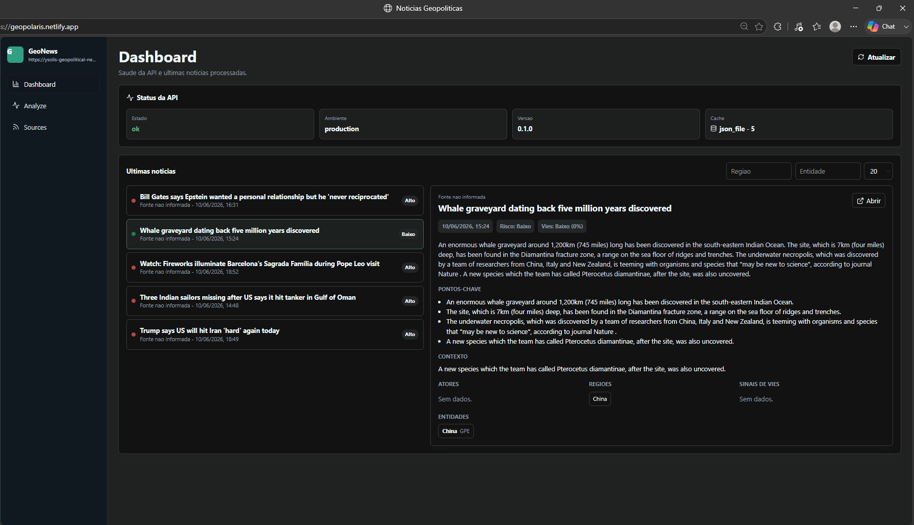
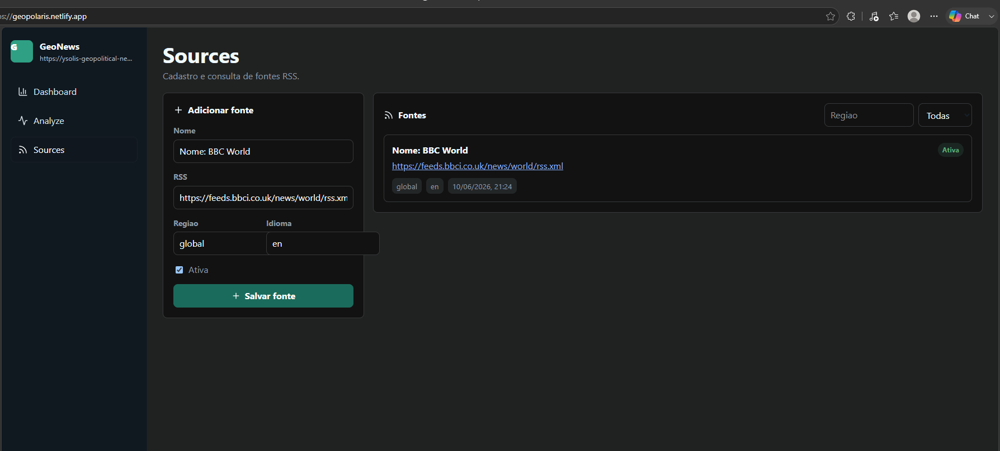
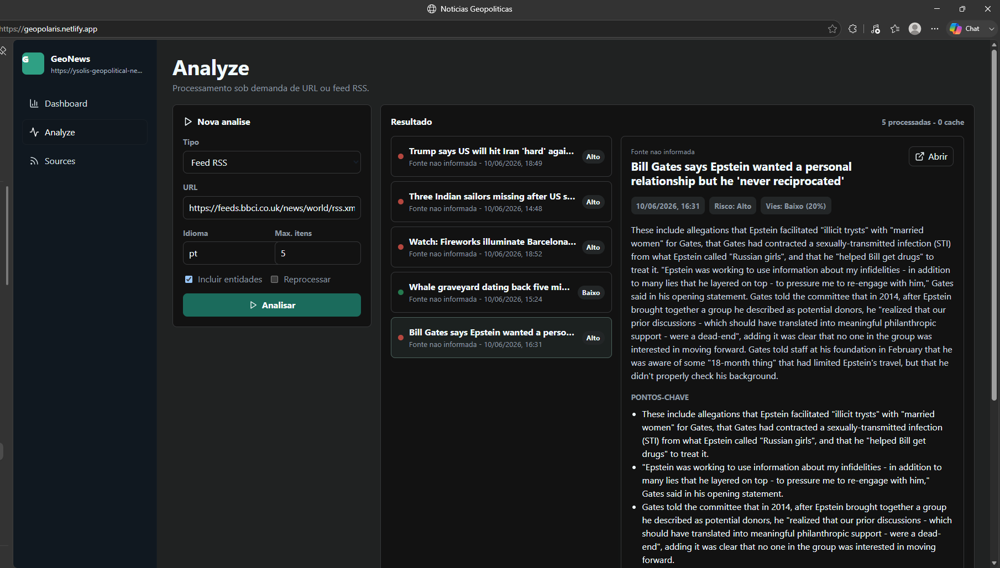

# Desenvolvimento

Use `backend/requirements-dev.txt` no desenvolvimento. O Dockerfile e qualquer runtime de produção devem usar `backend/requirements.txt`.

## Requisitos locais

- Python 3.11 ou superior.
- Node.js 20 LTS ou superior.
- npm.
- Docker Desktop com Linux engine ativo, apenas se for validar container.

## Backend

```powershell
cd backend
python -m venv .venv
.\.venv\Scripts\Activate.ps1
pip install -r requirements-dev.txt
python -m uvicorn app.main:app --reload --host 127.0.0.1 --port 8000
```

Healthcheck:

```powershell
Invoke-WebRequest -Uri http://localhost:8000/health -UseBasicParsing
```

Testes:

```powershell
cd backend
python -m pytest
```

Validação registrada em 2026-06-10: 8/8 passaram, com 1 warning de depreciação em `fastapi.testclient`/Starlette.

## Frontend

```powershell
cd frontend
npm install
npm run dev
```

Arquivo local:

```env
VITE_API_BASE_URL=http://localhost:8000
```

Testes e build:

```powershell
cd frontend
npm run test
npm run build
npm audit --audit-level=moderate
```

Validações registradas em 2026-06-10:

- `npm run test`: 4 arquivos e 8/8 testes passaram.
- `npm run build`: passou.
- `npm audit --audit-level=moderate`: 0 vulnerabilities.
- Build e execução local do Docker: validados.

## Variáveis de ambiente

### Backend

| Variável | Default | Observação |
| --- | --- | --- |
| `APP_ENV` | `development` | Também usado para preencher `ENVIRONMENT` no container. |
| `ENVIRONMENT` | valor de `APP_ENV` | Tem precedência no código quando definido. |
| `PORT` | `8000` | Mantido como configuração de ambiente; o `CMD` JSON do Space usa porta fixa 8000. |
| `CORS_ORIGINS` | localhost em dev, vazio fora de dev | Lista separada por vírgula. |
| `CACHE_PATH` | vazio | Quando definido, ativa cache JSON. |
| `CACHE_MAX_ITEMS` | `500` | Limite do cache local. |
| `REQUEST_TIMEOUT_SECONDS` | `10` | Timeout dos downloads externos. |
| `REQUEST_MAX_BYTES` | `2000000` | Limite de bytes por resposta externa. |
| `REQUEST_MAX_REDIRECTS` | `5` | Limite de redirecionamentos manuais. |
| `RSS_ENTRY_MAX_CHARS` | `20000` | Limite de texto usado por item RSS. |
| `SUMMARY_PROVIDER` | `local_extractive` | Provider atual de resumo. |

### Frontend

| Variável | Exemplo |
| --- | --- |
| `VITE_API_BASE_URL` | `http://localhost:8000` |

Variáveis `VITE_` são embutidas no bundle. Não coloque segredos no frontend.
No Netlify, use `VITE_API_BASE_URL=https://ysolis-geopolitical-news-api.hf.space`; não grave a URL no código.

## Contrato da API

O contrato canônico está em [`../openapi.yaml`](../openapi.yaml). Atualize o OpenAPI junto com qualquer mudança de endpoint, schema ou código de erro.

## Fluxo sugerido

1. Inicie o backend e valide `/health`.
2. Inicie o frontend com `VITE_API_BASE_URL` apontando para o backend local.
3. Teste `POST /analyze` com uma URL ou feed controlado.
4. Rode os testes do backend e do frontend antes de fechar a mudança.
5. Atualize docs quando comandos, variáveis ou contrato mudarem.



## Validação manual

Use a tela **Sources** para cadastrar um RSS e a tela **Analyze** para processar o feed. O exemplo abaixo usa o feed da BBC.





## Notas de manutenção

- `requirements.txt` deve conter apenas dependências de runtime.
- `requirements-dev.txt` deve incluir `-r requirements.txt` e ferramentas de teste/desenvolvimento.
- Itens RSS com `blocked_url` ou `invalid_url` são pulados durante análise de feed.
- Prefira RSS em testes manuais. Sites podem bloquear a coleta de uma URL direta; use, por exemplo, `https://feeds.bbci.co.uk/news/world/rss.xml`.
- `language` orienta o idioma preferencial da análise, mas não traduz o conteúdo na v1.
- A v1 não usa LLM nem oferece tradução.
- Feed direto sem fonte cadastrada usa o título do feed como origem; sem título, usa o domínio da URL.
- O cache local facilita a v1, mas não substitui banco para histórico durável ou múltiplas réplicas.
- No Space, `CACHE_PATH=/data/cache.json` depende do runtime e do storage configurados e pode não oferecer persistência durável.
