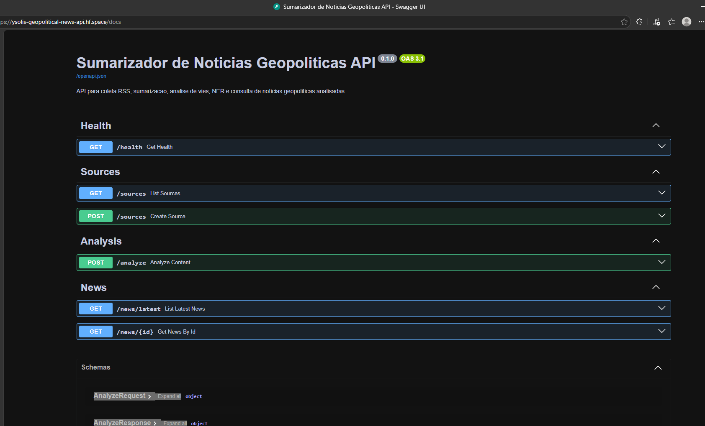

# Segurança

## Escopo

Este documento cobre a API backend que recebe URLs externas em `POST /analyze` e `POST /sources`, baixa artigos ou feeds RSS e armazena resultados em cache local ou JSON.

## Superfícies de ataque

- `POST /analyze`: aceita URL de artigo ou feed e dispara downloads HTTP externos.
- `POST /sources`: cadastra fontes externas.
- `GET /news/latest` e `GET /news/{id}`: expõem dados persistidos no cache.
- Variáveis de ambiente: `CORS_ORIGINS`, `REQUEST_TIMEOUT_SECONDS`, `REQUEST_MAX_BYTES`, `REQUEST_MAX_REDIRECTS`, `CACHE_PATH` e chaves futuras.
- Cache JSON em disco quando `CACHE_PATH` é definido.

## Mitigações implementadas

- URLs externas aceitam apenas `http` e `https`.
- Hosts `localhost`, domínios `.localhost`, IPs privados, loopback, link-local, multicast, reservados e não especificados são bloqueados.
- Antes do fetch, o host é resolvido por DNS. Se qualquer IP resolvido for bloqueado, a URL é rejeitada.
- Redirecionamentos não são seguidos automaticamente. Cada `Location` é normalizado, validado e resolvido antes de continuar.
- Limite padrão de redirecionamentos: `REQUEST_MAX_REDIRECTS=5`.
- Timeout padrão de downloads externos: `REQUEST_TIMEOUT_SECONDS=10`.
- Limite padrão de resposta externa: `REQUEST_MAX_BYTES=2000000`, validado por `Content-Length` e pelo stream recebido.
- `max_items` de feed RSS é limitado pelo schema a 20.
- Itens RSS com `blocked_url` ou `invalid_url` são pulados, em vez de derrubar o feed inteiro.
- Em desenvolvimento, CORS permite apenas localhost em portas comuns. Fora de desenvolvimento, o default é uma lista vazia.
- Erros conhecidos retornam `{code, message, details}`. Erros inesperados retornam `internal_error` sem stack trace.
- Erros de fetch usam URL reduzida sem query string.

## Riscos residuais

- A proteção SSRF reduz o risco básico, mas não elimina DNS rebinding, mudança de rota entre resolução e conexão ou proteções de rede incompletas do provedor.
- A v1 não tem autenticação nem rate limit.
- `CORS_ORIGINS=*` pode ser definido por configuração operacional. Não use esse valor em produção.
- Conteúdo externo pode conter texto malicioso. O frontend deve renderizar campos como texto, não como HTML confiável.
- O cache JSON não é criptografado.
- Sem banco ou trilha de auditoria, a investigação de abuso depende dos logs do ambiente de execução.

## Recomendações para produção

- Coloque a API atrás de um proxy com rate limit.
- Exija autenticação para endpoints que buscam URLs externas.
- Defina `CORS_ORIGINS` com o domínio exato do frontend.
- Rode o container como usuário sem privilégios, como já previsto no Dockerfile.
- Evite armazenar segredos em URLs ou conteúdo processado.
- Use logs do provedor para monitorar volume de chamadas e falhas de fetch.
- Considere uma allowlist de domínios RSS se o uso público crescer.
